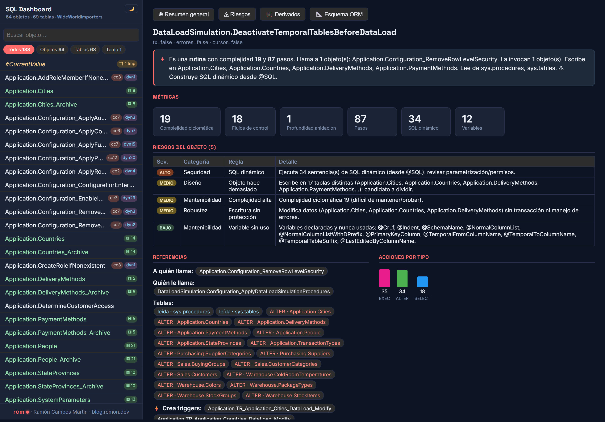
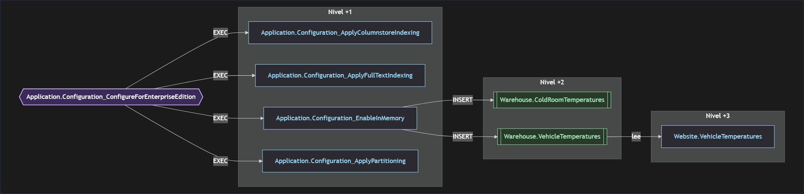
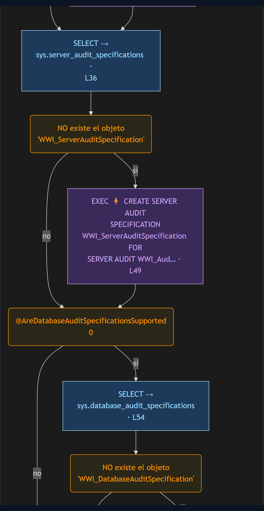
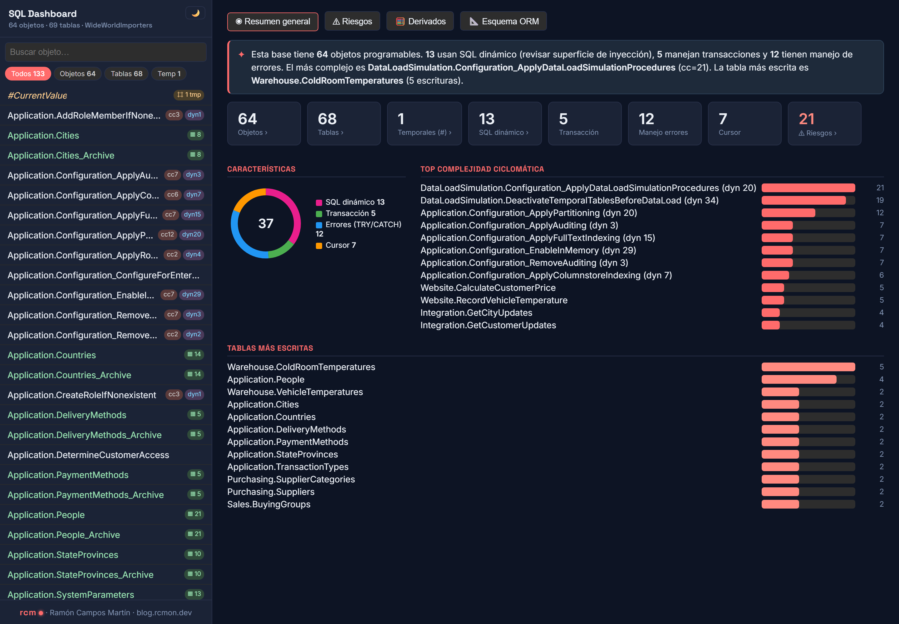
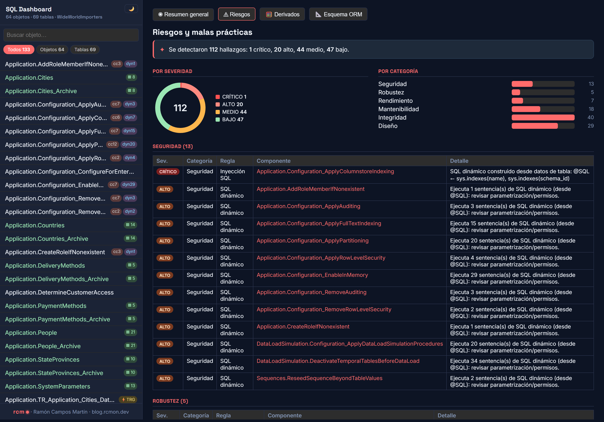

# T-SQL Lineage Toolkit

*Read this in [Spanish](README.md).*

[](https://github.com/rcm-on/tsql-lineage-toolkit/actions/workflows/ci.yml) [](LICENSE) [](https://dotnet.microsoft.com/)

**A deterministic lineage and impact engine for Microsoft SQL Server (T-SQL).** Point it at your stored procedures — from a live SQL Server or from `.sql` files — and it builds a queryable map of *what reads what, what writes where, and what breaks if you change it.* Down to the column. Through dynamic SQL. With no database running at query time.

> Built for **SQL Server / T-SQL** on the official `ScriptDom` grammar. It is not a generic SQL parser: it understands procedural T-SQL — cursors, dynamic `EXEC(@sql)`, `MERGE`, temp tables, multi-level nesting.

## Goal

Before renaming a column, dropping a table, or refactoring a 2,000-line stored procedure, you need **an answer you can trust: what depends on this?** The usual paths don't give you that well:

- **`sys.sql_expression_dependencies`** is accurate on what it sees — we've verified it, 12/12 and 22/22 on two databases — but it is **blind to dynamic SQL**: it doesn't see an object created at runtime, nor a table that only appears inside an `EXEC(@sql)`.
- **Grep / text search** doesn't distinguish a real `IF` from one inside an `@sql` string being built, and it doesn't follow a column through an `INSERT ... SELECT`.
- **An LLM reading the code** is non-deterministic: ask twice, get two answers — disqualified for a migration you have to sign off on.

This toolkit gives a **deterministic, grammar-aware** answer, as a portable artifact you can diff, version, and use as a gate in CI.

## The impact screen



### What's on this screen

The `DeactivateTemporalTablesBeforeDataLoad` procedure from WideWorldImporters. Every figure below is reproducible against the source and against the graph:

- **34 dynamic-SQL statements, resolved and counted.** The procedure builds its SQL into `@SQL` at runtime and fires it with 34 `EXECUTE (@SQL)` calls — the AST counts **34**, and the source has exactly 34. The contrast is in the control flow: a `grep` over the body finds **52** `IF` tokens, but **34 of them live *inside* the strings being built**; the AST recognizes the **18** real ones and a nesting depth of **1**. That gap, exactly where text analysis fails, is the whole point.
- **Business rules and risks, not just dependencies.** The object **writes to 17 distinct tables** ("does too much, candidate to split"), **modifies data without a transaction or error handling**, and executes dynamic SQL ("review parameterization/permissions"). Security, robustness, and maintainability risks derived from the AST, with severity.
- **Real control flows:** cyclomatic complexity 19, 18 control flows, 87 steps — metrics from the syntax tree, not from the text.
- **The impact graph:** who it calls, who calls it, and the tables it touches with its operation (`ALTER`, reads, …). It even detects that it **creates triggers dynamically**.
- **Natural-language summary**, automatic, at the very top — so a human (or an LLM) can understand the object without reading 87 steps.

All of this is offline, no server, by dragging a file onto the [dashboard](dashboard/).

## Impact, by level and depth



The impact chain unfolds **by level**, upstream and downstream, down to the depth you choose (1–5). Here `Configuration_ConfigureForEnterpriseEdition` → **Level +1**: the 4 procedures it executes → **Level +2**: the tables they end up inserting into → **Level +3**: the view that reads them. At a glance you get the blast radius by hop, not a flat list: you know how many hops away each thing is from what you're about to touch.

## The business flow, step by step



Each procedure is translated into its **real flowchart** from the AST — with its **decisions**, not a summary. Here `Configuration_ApplyAuditing`: *does `WWI_ServerAuditSpecification` already exist?* → if not, it creates it with dynamic SQL (`EXEC ⚡`); *does the server support audit specifications?* → branches. Every `IF` with its **yes/no** branches in natural language and the exact line. The business logic, with its conditions, readable without opening the `CREATE PROCEDURE`.

## What it is, and what it isn't

It's a **utility tool**, built by one person, not a data-governance product. It doesn't compete with Purview, Atlas, or commercial lineage suites, and it isn't meant to replace your catalog or your CI.

**Where it adds something:** the SQL Server catalog sees what's declared in `sys.objects` and little else — a trigger created inside an `EXEC(@sql)` or a table that only exists in a string built at runtime don't show up. A grep doesn't distinguish a real `IF` from one that lives inside the `@SQL` being assembled. Reading the procedure's full AST does see those things, and leaving it in a portable file lets you query it without a server.

**Where it doesn't add much, or there are simply better options:**

- **It's single-dialect.** T-SQL only. If you need multiple engines, [SQLGlot](https://github.com/tobymao/sqlglot) is more complete and more mature — in fact we use it **as an oracle** to validate our own column lineage (see [`eval/sqlglot-oracle/`](eval/sqlglot-oracle/)).
- **Column lineage isn't complete.** 98.8 % recall on a large production corpus, and 90 references we don't see, classified by root cause in [`eval/column-recall/`](eval/column-recall/).
- **It isn't data governance.** No catalog, glossary, permissions, or cross-system lineage.
- **No support or warranties.** It's MIT, published as-is.

### Validated against real SQL (and against oracles)

It's not just WideWorldImporters. It runs against **five corpora**, three of them third-party production code:

| Corpus | What it is | Input | Objects | Parse errors | Time |
| --- | --- | ---: | ---: | :---: | ---: |
| WideWorldImporters | Microsoft's OLTP sample, live database | 0.35 MB | 47 → 64 | **0** | 3.4 s |
| AdventureWorks2019 | classic sample, live database | 0.13 MB | 52 | **0** | 2.9 s |
| [SQL Server Maintenance Solution](https://github.com/olahallengren/sql-server-maintenance-solution) | Ola Hallengren, production | 0.52 MB | 4 + 3 tables | **0** | 3.0 s |
| [First Responder Kit](https://github.com/BrentOzarULTD/SQL-Server-First-Responder-Kit) | Brent Ozar, production | 2.29 MB | 11 + 1 table | **0** | 7.2 s |
| [DNN Platform](https://github.com/dnnsoftware/Dnn.Platform) | CMS, ~20 years of production T-SQL | 0.68 MB | 739 + 128 tables | **0** | — |

`sp_Blitz` is a **single 478 KB procedure** — 10,659 lines, cyclomatic complexity **706**, 1,328 steps, maximum nesting depth 9. It's processed with zero parse errors. From 0.35 MB to 2.29 MB (6.5×) the time rises from 3.4 s to 7.2 s (2.1×): the marginal cost is **~1.9 s per MB** of T-SQL (full `dotnet` process time, startup included).

**Checked against the SQL Server catalog** on the two live databases, with `validate`:

| | WideWorldImporters | AdventureWorks2019 |
| --- | :---: | :---: |
| Foreign keys vs `sys.foreign_keys` | **81 / 81** | **86 / 86** |
| `EXEC` chains vs `sys.sql_expression_dependencies` | **12 / 12** | **22 / 22** |
| Missing / phantom edges | 0 / 0 | 0 / 0 |

*These are the relationships that fall within the graph's scope, which is what `validate` compares — not the total declared in the database (98 and 90 foreign keys respectively).*
| View output columns | 32 / 32 | 251 / 251 |

> **Careful reading those 32/32 and 251/251 as "100% coverage".** They're small
> samples of one specific construct (view output columns). Measured
> on a large corpus of production T-SQL —679 procedures from DNN
> Platform, **7,786** column references according to `sys.dm_sql_referenced_entities`—
> the real recall is **98.77 %**, with **90 references the engine doesn't
> see**, classified one by one by root cause. The detail, the corpus, and the gate that measures it are at
> [`eval/column-recall/`](eval/column-recall/).

On precision, measured by evidence class in that same corpus:

| How the read was found | Backed by the oracle |
| --- | ---: |
| Written literally in the SQL | **99.79 %** |
| Expanded from a `SELECT *` | **98.89 %** |
| Reached by traversing a view | 4.2 % |

The third row **is not a failure**: these are reads we resolve all the way to the base table
while the oracle stops at the view. They're flagged with `via_view` in the graph
so they can be told apart. Measuring without separating them gave an overall precision
of 67.8 %, which hid the fact that direct extraction gets 99.79 % right.

And against corpora with their own oracle:

- **Real source code (WWI):** `DeactivateTemporalTablesBeforeDataLoad` reports **34** dynamic-SQL statements → the source has exactly **34** `EXECUTE (@SQL)` calls. And **18** control flows → what's left after subtracting the **34** `IF` tokens a grep finds *inside* the generated strings (52 raw).
- **Bad practices (`eval/bad-practices/`):** a corpus of anti-patterns with `expected-findings.json` as the oracle.
- **Complex constructs (`eval/community-edge-cases/`):** `MERGE`, recursive CTEs, dynamic SQL, cursors.
- **Column lineage (`eval/view-lineage/`):** checked against `sys.dm_sql_referenced_entities`.

In addition, **239 tests (xUnit)** cover the parser and **all of them run as a gate in CI**. Three are in the `Oracle` category and check against a live SQL Server: CI spins up a container with WideWorldImporters and AdventureWorks2019 restored ([`scripts/ci/restore-oracle-databases.sh`](scripts/ci/restore-oracle-databases.sh)).

> **What that validation found.** Running the new corpora uncovered **twelve defects** in the engine itself, **all fixed** —among them one serious one: with a certain `UPDATE` pattern, a table's identity split into two nodes and *"who writes here?"* returned zero when there were three writers. The detail, with the reproduction of each one, is in [`docs/corpus-multibase.md`](docs/corpus-multibase.md). It's published because a bug found and documented says more about a tool's reliability than an all-green table.

**Also checked against other parsers**, not just the catalog: over 253 objects (WideWorldImporters + AdventureWorks2019 + Ola Hallengren + First Responder Kit + DarlingData —another third-party corpus, distinct from the DNN Platform above), neither a generic tree-sitter SQL grammar (0.4% clean) nor the only T-SQL-specific tree-sitter grammar that exists (0% clean, breaks on a `WHERE` with an equality) comes close to `ScriptDom`. `sqlglot` with the T-SQL dialect set explicitly reaches 63.6%, but breaks on `RETURN`, `THROW`, or `SET TRANSACTION ISOLATION LEVEL` before it even gets to the dynamic SQL. And against [Graphify](https://github.com/Graphify-Labs/graphify)'s own code (multi-language code graph, tree-sitter) itself: its SQL extractor leaves **65% of WWI's procedures with no lineage edge at all** —100% on DarlingData—, because when its generic parser doesn't recognize a `CREATE PROCEDURE`, the design (reasonably) decides not to guess at relationships and keeps only the name. Full detail, methodology, and how each figure was verified are in [`docs/oracle-parsers-comparativa.md`](docs/oracle-parsers-comparativa.md).

## Use cases — where this problem shows up

It doesn't replace your SSMS or your CI: it **complements** them with the answer neither gives you quickly.

- **Before renaming or dropping a column/table** — the blast radius (procs, views, derived columns) in seconds, not by reading 40 procedures by hand.
- **Refactoring a legacy procedure** — the inbound and outbound **call chain**: who calls it, what it calls, what tables it touches and with what operation.
- **Migration / modernization** — a real dependency inventory before moving schemas or platforms; includes what lives in dynamic SQL and cursors.
- **Security audit** — where dynamic SQL gets built (injection surface), what writes without a transaction or error handling, destructive operations.
- **PR gate** — generate the graph on every change and diff it: fails if an undocumented write appears or a lineage breaks, inside your pipeline.
- **Onboarding / legacy database** — a navigable map instead of 500 undocumented procedures.
- **Governance and sensitive data (PII)** — traces a piece of data back to the column that produces it (provenance).
- **Deprecation** — does anyone still call this object? Detects what nobody uses anymore.
- **Fact base for AI agents** — a graph queryable with SQL so an LLM can answer with certainty instead of guessing over raw T-SQL.

## Real numbers

Run against **WideWorldImporters** (Microsoft's sample database), not a toy example:

| Metric | Value |
| --- | --- |
| Objects extracted from the database | 47 procedures/functions/views + 48 tables |
| Objects in the graph | **64** (the 47 + **17 triggers created at runtime** via dynamic SQL) |
| Tables in the graph | **69** (the 48 + 15 from the referenced `sys.*` catalog + 3 views + 2 tables created at runtime + 1 `OPENJSON` pseudo-table) |
| Graph nodes | 1,595 |
| Relationships | 4,390 |
| Parse errors | **0** |
| Foreign keys vs `sys.foreign_keys` | **81 / 81** — 0 missing, 0 phantoms *(the database declares 98; 81 fall within the graph's scope and are what `validate` compares)* |
| `EXEC` chains vs `sys.sql_expression_dependencies` | **12 / 12** — 0 missing, 0 phantoms |
| Output columns of WWI's 3 views | **32 / 32** *(small sample — see the real recall below)* |
| Business rules (`WHERE` modeled as `:BusinessRule`) | **19** (previously 0) |

The first two rows are the reason the tool exists: the database **has no triggers** in `sys.objects`, but the AST analysis discovers the **17** that `DeactivateTemporalTablesBeforeDataLoad` creates at runtime. A catalog inventory misses every single one.

> A `Table` node isn't always a base table: a **view** gets one too, so that a downstream `SELECT col FROM view` lands on the same `Column` node and the lineage doesn't break when passing through it.

*(Canonical run from **2026-08-01** against `.\SQLEXPRESS` · SQL Server 2025 (RTM-GDR) 17.0.1125.2 Express · commit `c9ccd56`. Literal console output, screenshots, and the full breakdown are in [`docs/ejecucion-canonica.md`](docs/ejecucion-canonica.md).)*

## Usage guide

You need **.NET 10** and, for the live-database mode, access to a SQL Server instance.

```bash
cd src/TSqlParser

# A) Desde un SQL Server vivo (incluye DDL de tablas → lineage de columna + FKs)
dotnet run -- extract MiBaseDatos ../../input.json --server .\SQLEXPRESS --tables

# B) O totalmente offline, desde ficheros .sql
dotnet run -- from-sql MiBaseDatos ../../input.json sql/*.sql

# Construir el grafo de lineage + la base SQLite consultable
dotnet run -- ../../input.json ../../graph_full.json --columns --sqlite --nodestore
```

Outputs: **`graph_full.json`** (canonical, diffable graph — version it), **`graph_full.db`** (SQLite database queryable with SQL), and the **NodeStore** (`--nodestore`, a representation optimized for AI agents).

### Querying impact with SQL

The SQLite database has `nodes` and `edges`. *"What breaks if I change a column?"* — transitive, through column derivation **and** call chains:

```sql
WITH RECURSIVE
  affected(col) AS (
    SELECT 'WideWorldImporters:table:sales.orderlines:column:UnitPrice'
    UNION SELECT e.src FROM edges e JOIN affected ON e.dst=affected.col
    WHERE e.type='DERIVES_FROM'),
  proc(p) AS (
    SELECT DISTINCT substr(e.src,1,instr(e.src,'#')-1)
    FROM edges e JOIN affected ON e.dst=affected.col
    WHERE e.type IN ('READS_COLUMN','WRITES_COLUMN'))
SELECT n.name FROM proc JOIN nodes n ON n.id=proc.p WHERE n.label='SqlObject';
```

### Audit examples (one query each)

```sql
-- ¿Qué objetos acceden a una tabla concreta?
SELECT DISTINCT substr(src,1,instr(src,'#')-1) FROM edges
WHERE dst LIKE '%:table:warehouse.stockitems' AND type IN ('READS_FROM','WRITES_TO');

-- ¿Dónde se construye SQL dinámico, y cuánto? (superficie de inyección)
SELECT name, dynamic_sql_steps FROM nodes
WHERE label='SqlObject' AND dynamic_sql_steps>0 ORDER BY dynamic_sql_steps DESC;

-- Procedimientos que modifican datos SIN TRY/CATCH
SELECT name FROM nodes WHERE label='SqlObject' AND has_error_handling=0;

-- Operaciones destructivas (DELETE / TRUNCATE / DROP)
SELECT action, COUNT(*) FROM nodes
WHERE label='Step' AND action IN ('DELETE','TRUNCATE','DROP') GROUP BY action;
```

Ready-made queries in `scripts/lineage-queries.sql` (`node scripts/run-query.js @audit_dynamic_sql`), or open `graph_full.db` in DB Browser / DBeaver.

## Visual dashboard (offline, no build)

Double-click to open [`dashboard/index.html`](dashboard/), **drag your `graph_full.json`** onto it, and explore instantly:



General overview, per-object/table view with control flow in **natural language**, multi-level impact chain, risk panel, and interactive ORM schema — all without a server.

### Risk audit, in one pass



The risk panel classifies every finding by **severity** and **category**. On WWI: **112 findings** (1 critical, 20 high, 44 medium, 47 low) — Integrity 40, Design 29, Maintainability 18, Security 13, Performance 7, Robustness 5 —, with the detail of the rule — from a **SQL injection** (the only critical one: `Configuration_ApplyColumnstoreIndexing` builds `@SQL` from `sys.indexes` data) to writes without a transaction, excessive complexity, or integrity issues. These are AST-derived rules, with severity and category; they don't replace a security review.

## In your CI/CD — an impact gate on every PR

The toolkit generates a `change_map` per branch and **diffs** them: `diff-change-map` exits with code **2** when the change introduces new impact, which turns it into a PR gate that **fails if you touch something whose blast radius hasn't been reviewed**.

```yaml
# .github/workflows/impacto.yml
name: Impacto SQL
on: pull_request
jobs:
  impact:
    runs-on: windows-latest
    steps:
      - uses: actions/checkout@v4
        with: { fetch-depth: 0 }
      - uses: actions/setup-dotnet@v4
        with: { dotnet-version: "10.0.x" }

      - name: Grafo de la rama base
        run: |
          git worktree add ../base ${{ github.event.pull_request.base.sha }}
          dotnet run --project src/TSqlParser -- from-sql MiBase base.json ../base/sql/*.sql
          dotnet run --project src/TSqlParser -- base.json base_graph.json --nodestore

      - name: Grafo de la rama del PR
        run: |
          dotnet run --project src/TSqlParser -- from-sql MiBase head.json sql/*.sql
          dotnet run --project src/TSqlParser -- head.json head_graph.json --nodestore

      - name: Gate de impacto (falla si hay impacto nuevo)
        run: dotnet run --project src/TSqlParser --
             diff-change-map base_graph.nodes head_graph.nodes change_map_diff.json --fail-on-new-impact
```

`change_map_diff.json` is kept as an artifact: which objects changed and who they affect. Ideal for **commenting on the PR** with the exact blast radius before approving.

## Honest limitations

- **SQL Server / T-SQL only** (`ScriptDom`); other dialects are out of scope.
- **Stores the analyzed lineage, not the source.** It answers "what depends on X?", not "show me the T-SQL for X".
- **Dynamic SQL is only resolved as far as it's statically reconstructible.** When the target depends on an input parameter —the typical case is `QUOTENAME(@DatabaseName)` to hit another database— there's no way to know without executing it, and the step is marked unresolved instead of guessing a false target. **How much this matters in real code: on the First Responder Kit, 197 of 277 dynamic steps (71%) are left unresolved.** The engine counts this object by object in `unresolved_dynamic_sql_steps`, so you know exactly how much you can't trust. On WideWorldImporters, by contrast, all 34 of 34 are resolved: the difference is whether the target depends on a parameter or not.
- **No confidence scoring yet**: a certain edge and an inferred one look the same. The groundwork is already measured —precision by evidence class, above— but it isn't exposed in the response yet.
- **Parameterized dynamic SQL can be recovered, but it needs runtime.** Statically it's impossible: if the table name is built with `QUOTENAME(@TableName)`, there's no way to know without executing it. With `capture-plans` (an Extended Events session + `enrich-from-plans`) it can: on `Sequences.ReseedSequenceBeyondTableValues` from WideWorldImportersDW, the edge to `Dimension.City` is recovered, invisible to static analysis. **The cost is that you have to run the workload**, and coverage depends on which paths get executed — a plan is proof of presence, never of absence.
- **Watch where you measure it.** On the First Responder Kit it discovers 906 edges and **none of them is a business table** (60 % temporary, 36 % internal SQL Server ones): FRK is DBA tooling and its dynamic SQL targets DMVs. Any "edges recovered" figure needs to be read broken down by target type.
- **Column lineage is 98.8 %, not 100 %.** Measured on 7,302 deduplicated references from a production corpus (DNN Platform); 90 are not seen, classified by cause. A missing edge means "not detected", not "proven not to exist". See [`eval/column-recall/`](eval/column-recall/).
- **It gives you the dependency map, not the migration plan.** It answers what depends on what; semantics, data quality, and business rules are still your work.
- **Tested at the scale of these five corpora** (the largest by object count: 739 modules from DNN Platform; the largest single-procedure size: `sp_Blitz`, 478 KB and 10,659 lines). There's no measurement yet on a database with thousands of procedures.

## Try it against your database

It's tested against a **real** database —**WideWorldImporters on SQL Server 2025 (17.0.1125.2, Express)**— and its hardest constructs: **dynamic SQL** (`EXEC(@sql)`), **cursors**, **`MERGE`**, **temp tables**, **runtime-created triggers**, and multi-level nesting. It comes out with 0 parse errors, and the lineage is checked against independent oracles (`sys.dm_sql_referenced_entities`, execution plans). Completeness is high, but not infinite.

So the invitation is direct: **point it at your database and try it.** If you find an object it doesn't extract well —a table that gets lost, a lineage that breaks, a strange pattern—, **open it as an issue with the case**. Every release narrows the gap, and real cases are the best corpus. Treat a missing edge as "not detected", not as "proven not to exist" — and tell us about it so we can improve it.

## License

MIT © Ramón Campos Martín — [blog.rcmon.dev](https://blog.rcmon.dev)
