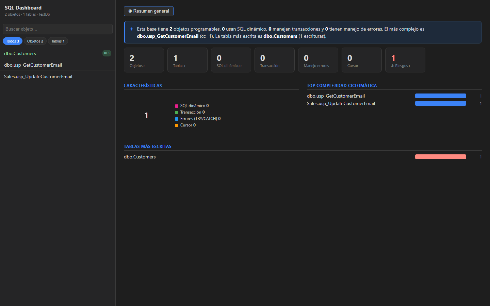
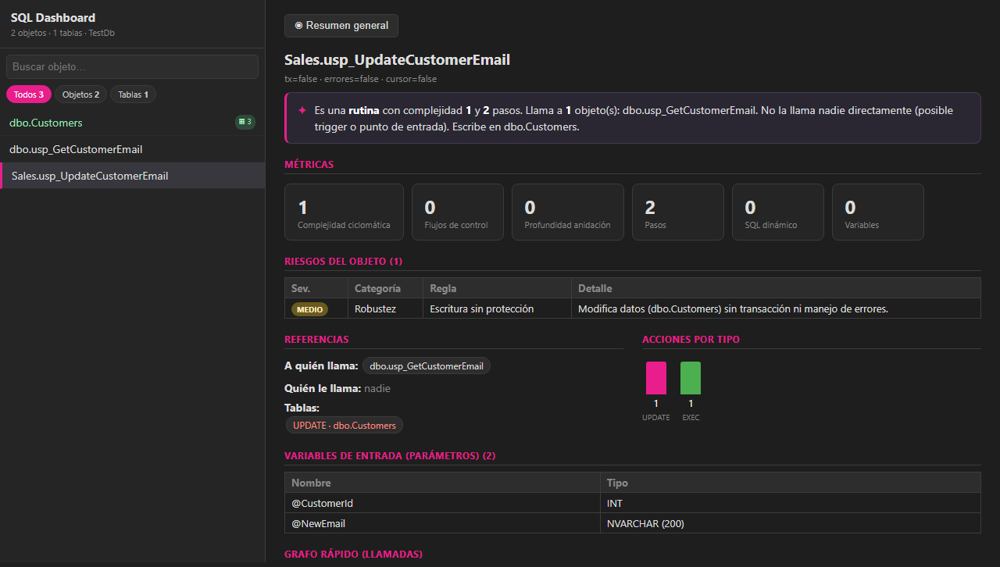

# TSql Lineage Toolkit

> **Know what breaks before you touch it.**  
> Production-grade T-SQL data lineage — static AST analysis fused with SQL Server execution plans, visualised in a zero-install browser dashboard.

<p align="center">
  
</p>

<p align="center">
  <a href="#quick-start"></a>
  
  
  
  <a href="CONTRIBUTING.md"></a>
</p>

---

## Why this tool exists

Before touching a stored procedure or renaming a column in a large SQL Server database, the question is always the same: **what breaks if I change this?** Answering it manually means reading hundreds of procedures. Commercial tools (Purview, DataHub) cost a fortune and still miss runtime-only table access.

This toolkit parses the real AST of every procedure / function / trigger / view (not regex), builds the full lineage graph, and then *fuses it with the SQL Server execution plan XML* to surface tables that are invisible to static analysis (dynamic SQL, view expansion, cross-DB calls).

---

## What makes it different

| Feature | This tool | Purview / DataHub |
|---|---|---|
| True AST parse (ScriptDom, not regex) | Yes | No |
| Execution plan enrichment (ShowPlanXML) | Yes — actual row counts | No |
| Runtime-discovered tables | Yes (tagged, confidence-scored) | No |
| Condition path per step (IF/WHILE/TRY) | Yes | No |
| Variable & dynamic-SQL tracking | Yes | No |
| Offline, zero-install dashboard | Yes | No |
| Agent-friendly NodeStore | Yes (16x less data to read) | No |
| Multi-source (Python, Spark, REST…) | No | Yes |
| Cost | Free / open source | €€€€ |

---

## Capabilities at a glance

- **Impact analysis** — "if I change `dbo.Customers.Email`, which procedures read or write it, directly or transitively?"
- **Migration planning** — detect hidden dependencies (dynamic SQL, `EXEC`, cascaded views) before refactoring
- **Onboarding / audit** — explore an unknown database visually without reading each SP line by line
- **Cyclomatic complexity** per object, with drill-down into each conditional branch
- **Execution plan fusion** — `Confirmed: 8, Discovered: 2` means 8 static edges verified by the real plan, 2 new runtime-only tables added
- **Multiple exports** — Neo4j JSON · GraphML (Gephi/yEd/Cytoscape) · Graphify/D3 · navigable NodeStore

---

## Screenshots

<table>
<tr>
<td align="center"><strong>General overview</strong></td>
<td align="center"><strong>Object detail: flow, risks, columns</strong></td>
</tr>
<tr>
<td></td>
<td></td>
</tr>
</table>

The dashboard runs entirely in the browser — no server, no build step, no npm. Drop `index.html` and upload your `graph_full.json`.

---

## Quick start

### Option A — from SQL files (no database connection needed)

```bash
git clone https://github.com/YOUR_GITHUB/tsql-lineage-toolkit
cd tsql-lineage-toolkit/src/TSqlParser

# Build an input.json from local .sql files (one CREATE PROC/TABLE per file)
dotnet run -- from-sql MyDatabase ../../input.json path/to/sql/*.sql

# Generate the lineage graph with column nodes
dotnet run -- ../../input.json ../../graph_full.json --columns

# Open the dashboard
start ../../dashboard/index.html   # Windows
open ../../dashboard/index.html    # macOS/Linux
```

### Option B — from a live SQL Server

```bash
# Extract all procedures + table DDL in one shot
dotnet run -- extract MyDatabase ../../input.json --server .\SQLEXPRESS --tables

# Generate graph
dotnet run -- ../../input.json ../../graph_full.json --columns

# (Optional) Enrich with a real execution plan XML
dotnet run -- enrich-from-plans ../../graph_full.json ../../graph_enriched.json plan.xml
```

Upload `graph_full.json` (or `graph_enriched.json`) to `dashboard/index.html`. Done.

> No database? Use `samples/from-sql-demo/graph.json` — it's the pre-built output for the bundled SQL examples.

---

## Execution plan enrichment

SQL Server can save an actual execution plan as XML (`.sqlplan` or `.xml`).  
Point the toolkit at it and it will:

1. **Confirm** static edges in-place — adds `confidence=1.0`, `confirmed_by="execution_plan"`, `actual_rows`
2. **Discover** new tables — runtime-only access tagged `source="execution_plan"`, shown as ⚡ in the dashboard

```bash
dotnet run -- enrich-from-plans graph_full.json graph_enriched.json plan1.xml plan2.xml
# Plans: 2  Procs matched: 2  Confirmed: 14  Discovered: 3
```

---

## All CLI commands

```
dotnet run -- <input.json> <graph.json> [workflows.json] [--columns] [--graphify] [--graphml] [--nodestore]
dotnet run -- from-sql <database> <input.json> <file.sql|dir|glob>
dotnet run -- extract <database> <input.json> [--server <server>] [--tables] [--object schema.name] [--like pattern]
dotnet run -- enrich-from-plans <graph.json> <out.json> <plan.xml> [plan2.xml ...]
dotnet run -- plan-summary <plan.xml>
dotnet run -- validate <graph.json> [--server <server>]
dotnet run -- update-nodestore <input.json> <graph.nodes/> [--columns]
```

---

## Repository layout

```
tsql-lineage-toolkit/
├── src/TSqlParser/          # .NET CLI + library
│   ├── AstWalker.cs          # ScriptDom AST traversal (the core)
│   ├── GraphExporter.cs      # Emits nodes/relationships (Neo4j JSON shape)
│   ├── ExecutionPlanParser.cs # Reads ShowPlanXML (actual + estimated)
│   ├── PlanEnricher.cs        # Noise-free static + runtime graph merge
│   ├── NodeStoreExporter.cs   # Agent-friendly partitioned node store
│   ├── GraphMlExporter.cs     # GraphML for Gephi / yEd / Cytoscape
│   └── GraphifyExporter.cs    # Flat {meta,stats,nodes,edges} for D3
│
├── tests/TSqlParser.Tests/   # xUnit test suite (42 tests)
│
├── dashboard/                # Offline browser dashboard (vanilla JS)
│   ├── src/shape.js           # JSON → dashboard model
│   ├── src/components.js      # All UI components
│   └── e2e/                   # Playwright smoke tests
│
├── samples/                  # Ready-to-use example inputs & outputs
│   └── from-sql-demo/         # Pre-built graph for WideWorldImporters-style demo
│
└── eval/                     # Evaluation scripts and execution plan samples
    └── plans/                 # Sample ShowPlanXML files
```

---

## Export formats

| Format | Flag | Use it with |
|---|---|---|
| Neo4j JSON | *(default)* | Dashboard, this repo's pipeline |
| GraphML | `--graphml` | Gephi · yEd · Cytoscape · NetworkX |
| Graphify/D3 | `--graphify` | vis-network · D3 · any flat-graph viewer |
| NodeStore | `--nodestore` | AI agents (Claude Code, Copilot, custom) |

**NodeStore** splits the graph into small, navigable files. An agent answering "what writes to `Warehouse.StockItems`?" reads 3 files (93 KB) instead of the full 1.5 MB graph — **16x less data, answer already pre-structured**.

---

## Running tests

```bash
dotnet build
dotnet test
# All 42 tests pass (xUnit)
```

End-to-end dashboard smoke test:

```bash
cd dashboard/e2e
npm ci
npx playwright test
```

---

## Contributing

Contributions are welcome — whether it's a bug report, a new SQL pattern that isn't tracked, a dashboard improvement, or a new export format.

### Good first issues
- Add support for `MERGE` statement target tracking
- Detect `TRUNCATE TABLE` as a WRITES_TO edge
- Dashboard: dark/light theme toggle
- Dashboard: export current view as PNG / SVG
- Add confidence scoring to all static READS_FROM / WRITES_TO edges
- Support `INSERT INTO ... SELECT` column-level derivation

### How to contribute

```bash
# 1. Fork + clone
git clone https://github.com/YOUR_GITHUB/tsql-lineage-toolkit

# 2. Create a branch
git checkout -b feature/my-improvement

# 3. Make your change + add a test in tests/TSqlParser.Tests/
dotnet test   # must stay green

# 4. Open a PR — describe the SQL pattern or dashboard behaviour you changed
```

If you're adding a new T-SQL pattern, please include a minimal `CREATE PROCEDURE` example and the expected edges in your PR description. The `eval/` folder has examples you can follow.

---

## Roadmap ideas

- [ ] VIEW expansion — resolve `INSERT INTO view` to base table at lineage time
- [ ] Cross-database EXEC lineage (follow `EXEC OtherDb.dbo.spProc`)
- [ ] Lineage diff between two graph snapshots (what changed between releases?)
- [ ] REST API mode — serve the graph over HTTP for IDE plugins
- [ ] VS Code extension — hover a table name, see who writes to it

---

## Author

Built by **R. Campos Martín** — data engineer & SQL Server specialist.

- Email: [rcamposmartin@hotmail.com](mailto:rcamposmartin@hotmail.com)
- GitHub: [@YOUR_GITHUB](https://github.com/YOUR_GITHUB)
- LinkedIn: [linkedin.com/in/YOUR_LINKEDIN](https://linkedin.com/in/YOUR_LINKEDIN)

If this tool saves you time, a star on GitHub helps others find it.  
If you use it in a project or company, I'd love to hear about it — open a Discussion or send an email.

---

*Built with [Microsoft.SqlServer.TransactSql.ScriptDom](https://www.nuget.org/packages/Microsoft.SqlServer.TransactSql.ScriptDom) · Visualised with [Mermaid.js](https://mermaid.js.org/) · No cloud, no telemetry, no lock-in.*
