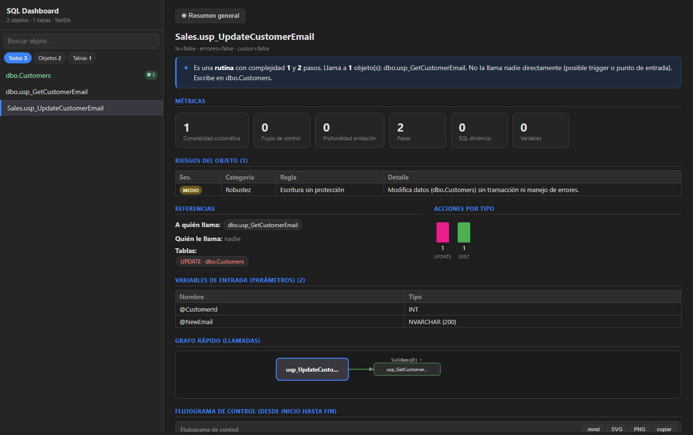
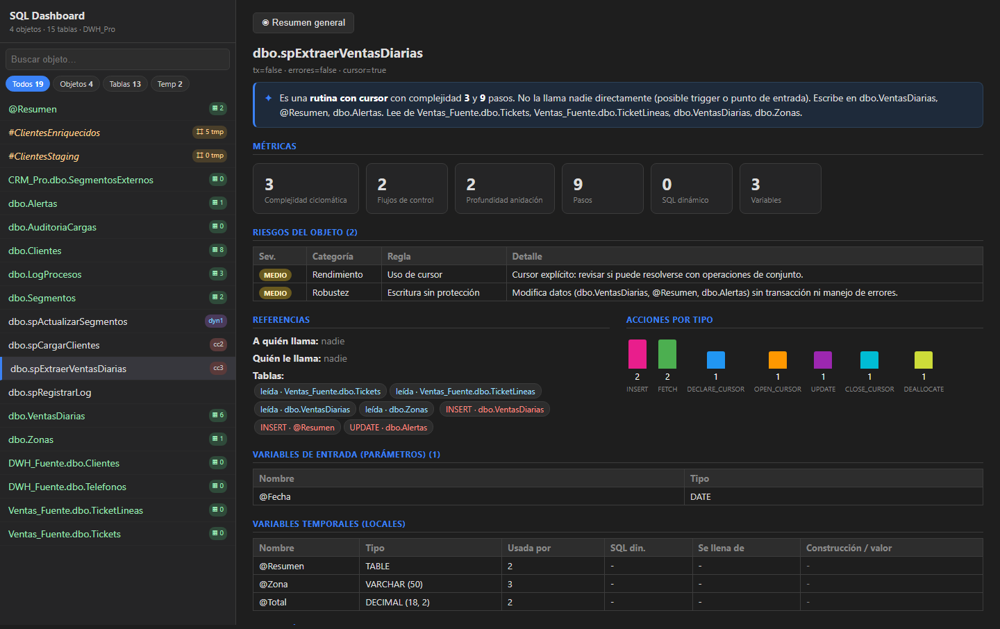
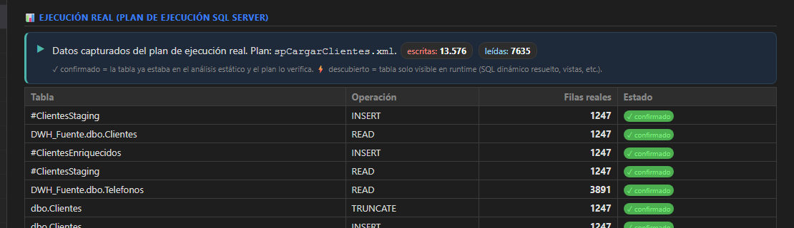
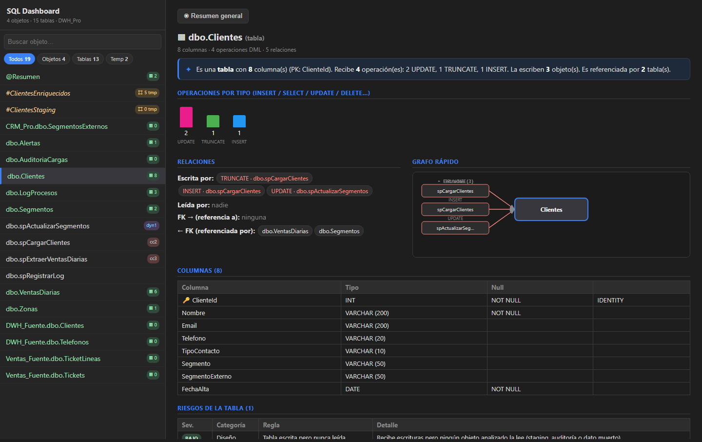
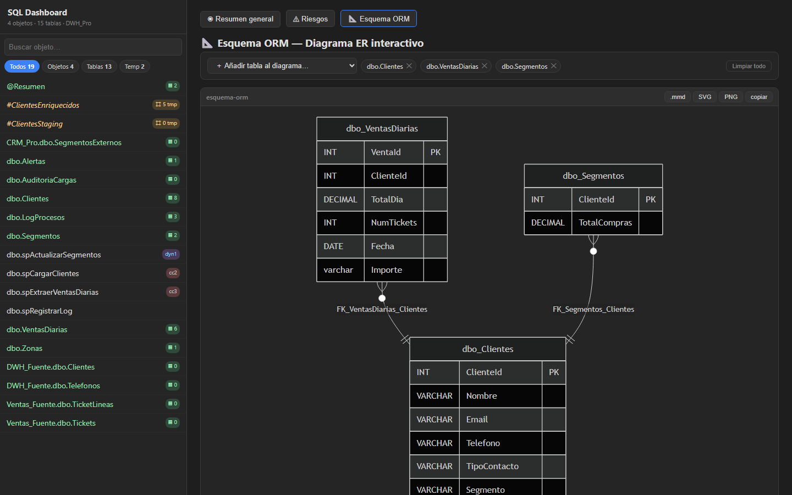
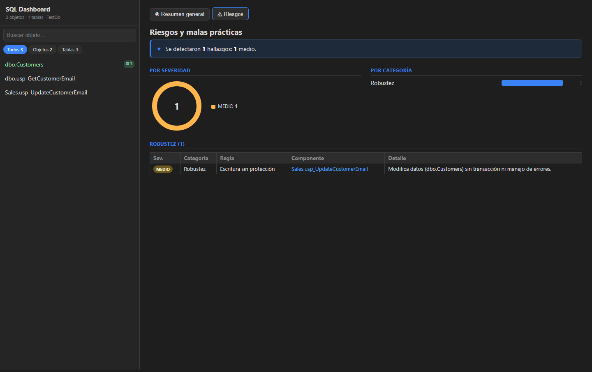
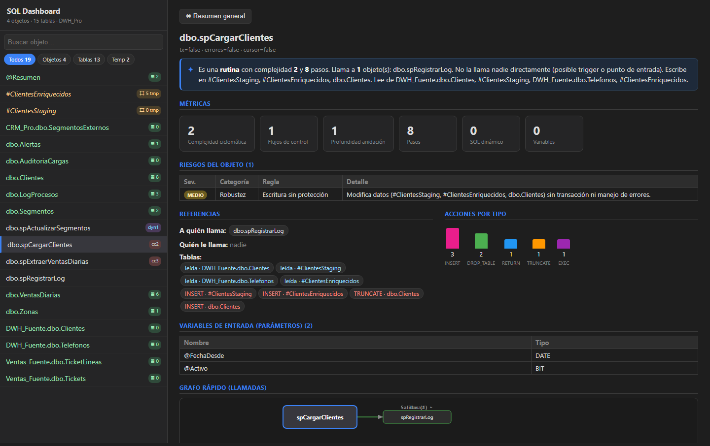

# TSql Lineage Toolkit

> **Know what breaks before you touch it.**  
> Production-grade T-SQL data lineage — static AST analysis fused with SQL Server execution plans, visualised in a zero-install browser dashboard.


[](#quick-start)
[](#)
[](#dashboard)
[](#export-formats)
[](LICENSE)
[](CONTRIBUTING.md)
[](https://blog.rcmon.dev)
[](https://www.linkedin.com/in/ramón-campos-78aba234)

---

## Why this tool exists

Before touching a stored procedure or renaming a column in a large SQL Server database, the question is always the same: **what breaks if I change this?** Answering it manually means reading hundreds of procedures. Commercial tools (Purview, DataHub) cost a fortune and still miss runtime-only table access.

This toolkit parses the real AST of every procedure / function / trigger / view (not regex), builds the full lineage graph, and then *fuses it with the SQL Server execution plan XML* to surface tables that are invisible to static analysis — dynamic SQL, view expansion, cross-database calls.

It doesn't stop at "table A feeds table B". Every column-to-column edge carries the **exact T-SQL expression that produced it** (`logic`), the **line of code it ran on** (`line_no`) and the **step that caused the mutation** (`caused_by_step`) — so "where does `TaxAmount` come from?" is answered with the literal formula (`ROUND(ol.PickedQuantity * ol.UnitPrice * ol.TaxRate / 100.0, 2)`), not just a table name.

---

## All advantages at a glance

| # | Advantage | Why it matters |
|---|---|---|
| 1 | **True AST parse** via ScriptDom | No false positives from regex; handles nested IF/WHILE/TRY, dynamic SQL, cursors |
| 2 | **Execution plan fusion** (ShowPlanXML) | Surfaces runtime-only tables with actual row counts — unique in the open-source space |
| 3 | **Confidence scoring** on every edge | Static=inferred · confirmed=plan verified · discovered=runtime-only |
| 4 | **Cyclomatic complexity** per object | Identifies high-risk procs before a migration |
| 5 | **Condition path** per step | Each SQL step knows which IF/WHILE/TRY branch it lives in |
| 6 | **Column-level lineage with the transformation formula** | `DERIVES_FROM` edges carry the literal T-SQL expression (`logic`), source line (`line_no`) and causing step (`caused_by_step`) — not just "column A feeds column B" |
| 7 | **Variable & dynamic SQL tracking** | Detects variables used to build `EXEC(@sql)` strings |
| 8 | **Table variable tracking** (`@TableVar`) | Captures INSERT into `@TableVar` as a lineage target |
| 9 | **Offline dashboard** — zero install | Drop `index.html` in a browser; no npm, no server, no cloud |
| 10 | **Interactive ORM diagram** | Select tables → Mermaid ER diagram with columns and FK arrows |
| 11 | **Multiple export formats** | Neo4j JSON · GraphML · D3/Graphify · navigable NodeStore |
| 12 | **Agent-friendly NodeStore** | AI tools read 16–60x less data to answer lineage questions |
| 13 | **Incremental updates** | `update-nodestore` only rewrites objects whose content actually changed — 11–57x less I/O than regenerating the full graph, measured on real edits ([proof](docs/nodestore-analysis.md#caso-3--actualizar-tras-editar-1-de-47-objetos-coste-de-escritura-no-de-lectura-wideworldimporters-mismo-corpus-que-el-caso-1)) |
| 14 | **No cloud, no telemetry, no license fee** | Runs fully on-premise on Windows/Linux/macOS |
| 15 | **Live SQL Server integration** | `extract` + `validate` commands; or work from `.sql` files offline |
| 16 | **AI-cost optimised** | NodeStore: 16–60× fewer tokens vs full graph load; fits any context window |
| 17 | **Business-rule lineage** (`CONDITIONED_BY`) | For `UPDATE T SET Col = ... WHERE Filter`, links the written column directly to the `WHERE`/`JOIN-ON` columns that decided which rows changed — answers "what condition gated this mutation?" in one hop, distinct from `DERIVES_FROM`'s "what was it computed from?" |
| 18 | **Transitive `#temp`/`@TableVar` lineage** | `INSERT #Staging SELECT Col FROM A` then `INSERT B SELECT Col FROM #Staging` resolves straight through to `B.Col DERIVES_FROM A.Col` (tagged `via_transient`) — no phantom Table node for the temp bridge, and the chain survives any number of hops |
| 19 | **VIEW expansion** | A view's own `SELECT` body is parsed for its real base table(s); any `SELECT ... FROM AnalyzedView` elsewhere bridges straight through to those base tables/columns (tagged `via_view`), not just the view's own node |
| 20 | **Cross-database CALLS resolution** | `EXEC OtherDb.dbo.Proc` resolves to the real analyzed object in `OtherDb` (not just a dangling text label), tagged `is_cross_database` |

---

## Comparison with other tools

### vs. free / open-source tools

| Tool | AST parse | Execution plan | Dashboard | Column lineage | Transformation logic on edge | ORM diagram | Agent-ready |
|---|---|---|---|---|---|---|---|
| **TSql Lineage Toolkit** | ScriptDom | Yes (actual rows) | Yes, offline | Yes | Yes (`logic` + `line_no`) | Yes | Yes (NodeStore) |
| sqllineage (Python) | Statement-level regex | No | No | No | No | No | No |
| Apache Atlas | Metadata catalog | No | Generic | No | No | No | No |
| dbt lineage | dbt models only | No | dbt Cloud | Limited | No | No | No |
| OpenLineage | Emission-based | No | External | No | No | No | No |
| Custom regex scripts | Regex (errors) | No | No | No | No | No | No |

### vs. commercial / enterprise tools

| Tool | Price | AST parse | Execution plan | Offline | Customisable |
|---|---|---|---|---|---|
| **TSql Lineage Toolkit** | Free | Yes | Yes | Yes | Full source |
| Microsoft Purview | €€€€ / Azure-only | No (catalog) | No | No | No |
| DataHub (Acryl) | €€€ SaaS | No | No | No | Plugin API |
| Octopai | €€€€ enterprise | No | No | No | No |
| Informatica IDMC | €€€€€ enterprise | No | No | No | No |
| Redgate SQL Source Control | €€ | Schema diff only | No | Partial | No |
| dbt Cloud | €€ | dbt only | No | No | Partial |

**Bottom line**: no free tool parses the ScriptDom AST, reads execution plan XML, or attaches the actual transformation expression to a column-lineage edge. No paid tool at any price tier fuses static analysis with actual execution plan data for runtime table discovery.

---

## Screenshots

### General overview — database-level stats


### Object detail — metrics, risks, references, call graph



### Complex procedure — cursor, variables, multi-table lineage



### Execution plan fusion — actual row counts, confirmed vs discovered



### Table schema — columns, types, FK graph, writers/readers



### Interactive ORM diagram — add/remove tables dynamically, FK arrows drawn automatically

- Dropdown to **add** any table → it appears in the diagram with full column design
- **✕** on each chip to remove it
- **+NFk** to expand all FK neighbours in one click
- **Click a table inside the SVG** to expand its relations directly in the diagram
- Export as `.mmd`, SVG or PNG with the toolbar buttons



### Risk analysis — code quality findings across all objects



---

## Quick start

### Option A — from SQL files (no database connection needed)

```bash
git clone https://github.com/rcm-on/tsql-lineage-toolkit
cd tsql-lineage-toolkit/src/TSqlParser

# Build input.json from local .sql files (one CREATE PROC/TABLE per file)
dotnet run -- from-sql MyDatabase ../../input.json path/to/sql/*.sql

# Generate the lineage graph with column nodes and table design
dotnet run -- ../../input.json ../../graph_full.json --columns

# Open the dashboard (no install needed)
start ../../dashboard/index.html   # Windows
open  ../../dashboard/index.html   # macOS/Linux
```

### Option B — from a live SQL Server

```bash
# Extract all procedures + table DDL in one shot
dotnet run -- extract MyDatabase ../../input.json --server .\SQLEXPRESS --tables

# Generate graph
dotnet run -- ../../input.json ../../graph_full.json --columns

# (Optional) Enrich with a real execution plan XML
dotnet run -- enrich-from-plans ../../graph_full.json ../../graph_enriched.json plan.xml
```

Upload `graph_full.json` (or `graph_enriched.json`) to `dashboard/index.html`. Done.

> No database? Use `samples/from-sql-demo/graph.json` — pre-built output for the bundled SQL examples, ready to drop into the dashboard.

---

## Execution plan enrichment

SQL Server can export any query's actual execution plan as XML (`.sqlplan` / `.xml`).  
Point the toolkit at it and it will:

1. **Confirm** static edges in-place — adds `confidence=1.0`, `confirmed_by="execution_plan"`, `actual_rows`
2. **Discover** new tables — runtime-only access tagged `source="execution_plan"`, shown as ⚡ in the dashboard

```bash
dotnet run -- enrich-from-plans graph_full.json graph_enriched.json plan1.xml plan2.xml
# Plans: 2  Procs matched: 2  Confirmed: 14  Discovered: 3
```



---

## All CLI commands

```
dotnet run -- <input.json> <graph.json> [--columns] [--graphify] [--graphml] [--nodestore]
dotnet run -- from-sql <database> <input.json> <file.sql|dir|glob>
dotnet run -- extract <database> <input.json> [--server <srv>] [--tables] [--object schema.name] [--like pattern]
dotnet run -- enrich-from-plans <graph.json> <out.json> <plan.xml> [plan2.xml ...]
dotnet run -- plan-summary <plan.xml>
dotnet run -- validate <graph.json> [--server <srv>]
dotnet run -- update-nodestore <input.json> <graph.nodes/> [--columns]
```

---

## Repository layout

```
tsql-lineage-toolkit/
├── src/TSqlParser/            # .NET CLI + library
│   ├── AstWalker.cs            # ScriptDom AST traversal (the core)
│   ├── GraphExporter.cs        # Emits nodes/relationships (Neo4j JSON shape)
│   ├── ExecutionPlanParser.cs  # Reads ShowPlanXML (actual + estimated)
│   ├── PlanEnricher.cs         # Noise-free static + runtime graph merge
│   ├── NodeStoreExporter.cs    # Agent-friendly partitioned node store
│   ├── GraphMlExporter.cs      # GraphML for Gephi / yEd / Cytoscape
│   └── GraphifyExporter.cs     # Flat {meta,stats,nodes,edges} for D3
│
├── tests/TSqlParser.Tests/    # xUnit test suite (54 tests)
│
├── dashboard/                 # Offline browser dashboard (vanilla JS, no build)
│   ├── src/shape.js            # JSON → dashboard model
│   ├── src/components.js       # All UI components incl. ORM diagram builder
│   └── e2e/                    # Playwright smoke tests + screenshot generator
│
├── docs/                      # Screenshots for this README
├── samples/                   # Ready-to-use example inputs and outputs
└── eval/                      # Evaluation scripts and execution plan samples
```

---

## Export formats

| Format | Flag | Use it with |
|---|---|---|
| Neo4j JSON | *(default)* | Dashboard, this repo's pipeline |
| GraphML | `--graphml` | Gephi · yEd · Cytoscape · NetworkX |
| Graphify/D3 | `--graphify` | vis-network · D3 · any flat-graph viewer |
| NodeStore | `--nodestore` | AI agents (Claude Code, Copilot, custom) |

**NodeStore** splits the graph into small, navigable files. An agent answering "what writes to `Warehouse.StockItems`?" reads 3 files (93 KB) instead of the full 1.5 MB graph — **16x less data, 6.5x faster, answer already pre-structured with indirect hop chains**.

That's the *read* side. On the *write* side, `update-nodestore` hashes every object/shared resource and only rewrites what actually changed: editing 1 of 47 procedures rewrites ~144 KB (the object file + the small global indexes) instead of regenerating the full 1.54 MB graph — **11–57x less I/O**, and a comment-only edit that doesn't change the analysis rewrites **0 bytes**.

→ Full analysis with token costs, agent navigation protocol and framework integrations: **[docs/ai-agents.md](docs/ai-agents.md)**
→ Measured read/write benchmarks (files, bytes, hops, time) on real WideWorldImporters data: **[docs/nodestore-analysis.md](docs/nodestore-analysis.md)**

---

## Running tests

```bash
dotnet build
dotnet test
# 54/54 tests pass (xUnit)
```

End-to-end dashboard smoke test:

```bash
cd dashboard/e2e
npm ci
node check-dashboard.js
```

Regenerate README screenshots:

```bash
cd dashboard/e2e
node screenshots.js
```

---

## Contributing

All contributions are welcome — bug reports, new SQL patterns, dashboard improvements, export format plugins.

### Good first issues

- `MERGE` statement target tracking
- `TRUNCATE TABLE` → WRITES_TO edge
- Dashboard: light/dark theme toggle
- Dashboard: export current view as PNG / SVG
- Confidence scoring on all static READS_FROM / WRITES_TO
- `INSERT INTO ... SELECT` column-level derivation
- VIEW expansion (resolve to base tables at lineage time)

### How to contribute

```bash
# 1. Fork + clone
git clone https://github.com/rcm-on/tsql-lineage-toolkit

# 2. Create a branch
git checkout -b feature/my-improvement

# 3. Change + test
dotnet test   # must stay green

# 4. Open a PR — include a minimal CREATE PROCEDURE example and expected edges
```

If you add a new T-SQL pattern, include a test case in `tests/TSqlParser.Tests/LineageTests.cs` with the minimal SQL and the expected READS_FROM / WRITES_TO edges.

---

## Roadmap

- [ ] Lineage diff between two graph snapshots (what changed between releases?)
- [ ] REST API / HTTP server mode for IDE plugins
- [ ] VS Code extension — hover a table name → instant lineage popup

---

## Author

Built and maintained by **Ramón Campos Martín** — data engineer & SQL Server specialist.

📧 [rcamposmartin@hotmail.com](mailto:rcamposmartin@hotmail.com)  
🐙 [@rcm-on](https://github.com/rcm-on)  
💼 [linkedin.com/in/ramón-campos-78aba234](https://www.linkedin.com/in/ramón-campos-78aba234)  
📝 [blog.rcmon.dev](https://blog.rcmon.dev)

If this tool saves you time, a ⭐ on GitHub helps others find it.  
If you use it at your company, open a Discussion or send me an email — I'd love to hear about it.

---

*Built with [Microsoft.SqlServer.TransactSql.ScriptDom](https://www.nuget.org/packages/Microsoft.SqlServer.TransactSql.ScriptDom) · Visualised with [Mermaid.js](https://mermaid.js.org/) · No cloud · No telemetry · No lock-in · [MIT License](LICENSE)*
